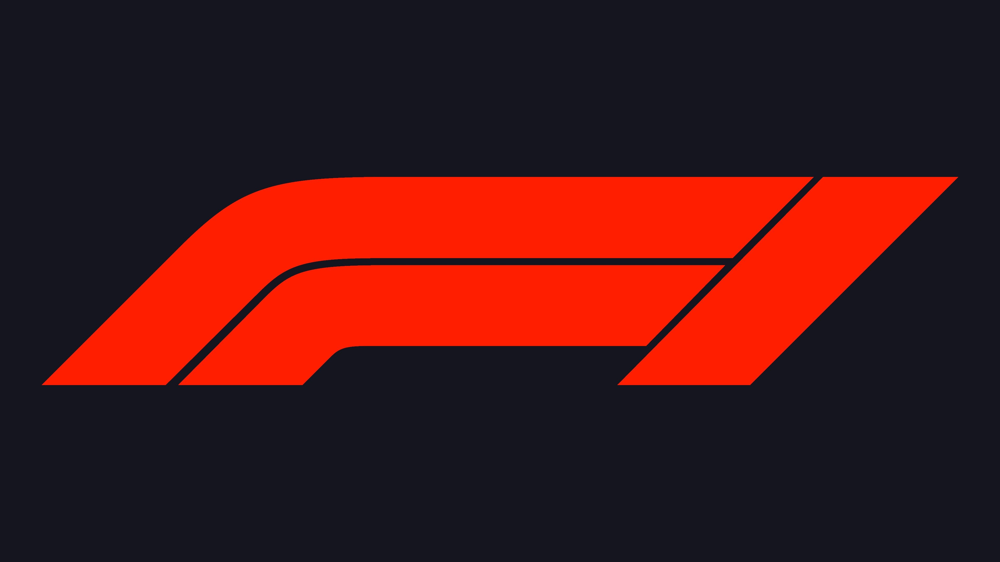
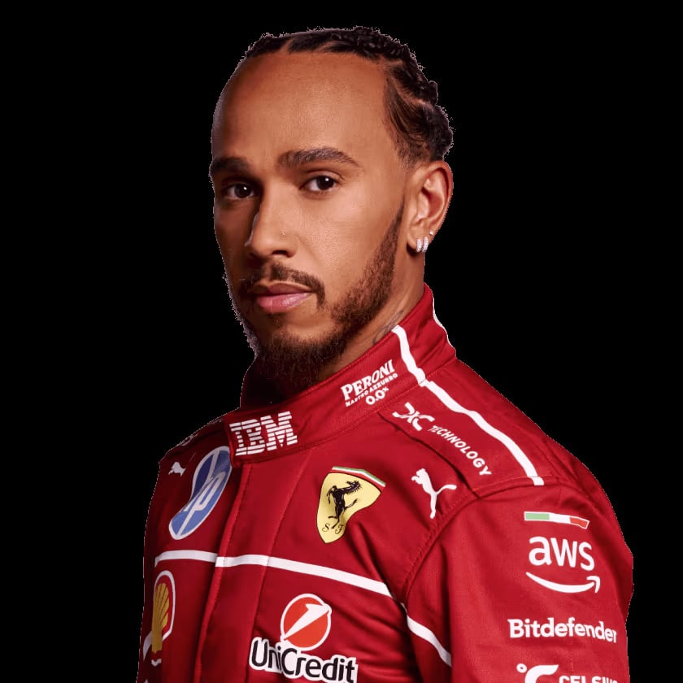
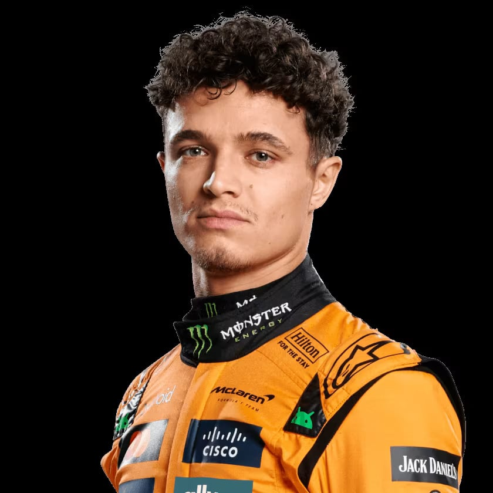

# Simulador de Corridas da Formula 1 com Node.js

Este projeto apresenta uma simulação de corrida de Fórmula 1, onde o desempenho dos competidores é influenciado tanto por suas habilidades individuais quanto pelas condições variáveis da pista. A aplicação foi desenvolvida com Node.js, aplicando conceitos de lógica, aleatoriedade e estruturação de regras de negócio.

<table>
        <tr>
            <td>
                
            </td>
            <td>
                <b>Objetivo:</b>
                
Este projeto consiste na criação de um simulador de corrida inspirado na Fórmula 1. O desafio é desenvolver a lógica de um jogo de corrida em Node.js, onde pilotos da temporada atual disputam voltas utilizando atributos como Velocidade, Curva e Agressividade.

            </td>
        </tr>
    </table>

<h2>Pilotos</h2>
      <table style="border-collapse: collapse; width: 800px; margin: 0 auto;">
        <tr>
            <td style="border: 1px solid black; text-align: center;">
                
Lewis Hamilton

                
            </td>
            <td style="border: 1px solid black; text-align: center;">
                
Velocidade: 4

                
Curva: 5

                
Agressividade: 5

            </td>
             <td style="border: 1px solid black; text-align: center;">
                
Max Verstappen

                
            </td>
            <td style="border: 1px solid black; text-align: center;">
                
Velocidade: 5

                
Curva: 5

                
Agressividade: 5

            </td>
              <td style="border: 1px solid black; text-align: center;">
                
Charles Leclerc

                
            </td>
            <td style="border: 1px solid black; text-align: center;">
                
Velocidade: 5

                
Curva: 4

                
Agressividade: 4

            </td>
        </tr>
        <tr>
            <td style="border: 1px solid black; text-align: center;">
                
Lando Norris

                
            </td>
            <td style="border: 1px solid black; text-align: center;">
                
Velocidade: 4

                
Curva: 4

                
Agressividade: 4

            </td>
            <td style="border: 1px solid black; text-align: center;">
                
Fernando Alonso

                
            </td>
            <td style="border: 1px solid black; text-align: center;">
                
Velocidade: 4

                
Curva: 4

                
Agressividade: 5

            </td>
            <td style="border: 1px solid black; text-align: center;">
                
Carlos Sainz

                
            </td>
            <td style="border: 1px solid black; text-align: center;">
                
Velocidade: 4

                
Curva: 3

                
Agressividade: 3

            </td>
        </tr>
    </table>

<h3>🕹️ Regras & mecânicas:</h3>

<b>Jogadores:</b>

<label for="jogadores-item">O Computador deve receber dois pilotos para disputar a corrida em um objeto cada, onde cada jogador escolhe seu próprio piloto.</label>

<b>Corrida:</b>

<ul>
  <li> <label for="pistas-1-item">Os pilotos irão correr em uma corrida aleatória de 5 rodadas</label></li>
  <li> <label for="pistas-2-item">A cada rodada, será sorteado um bloco da pista que pode ser uma reta, curva ou confronto</label>
    <ul>
      <li><label for="pistas-2-1-item">Caso o bloco da pista seja uma RETA, o jogador deve jogar um dado de 6 lados e somar o atributo VELOCIDADE, quem vencer ganha um ponto</label></li>
      <li><label for="pistas-2-2-item">Caso o bloco da pista seja uma CURVA, o jogador deve jogar um dado de 6 lados e somar o atributo CURVA, quem vencer ganha um ponto</label></li>
      <li><label for="pistas-2-3-item">Caso o bloco da pista seja um CONFRONTO, o jogador deve jogar um dado de 6 lados e somar o atributo AGRESSIVIDADE, quem perder, perde um ponto</label></li>
      <li><label for="pistas-2-3-item">Nenhum jogador pode ter pontuação negativa (valores abaixo de 0)</label></li>
    </ul>
  </li>
</ul>

<b>Condição de vitória:</b>

<label for="vitoria-item">Ao final, vence quem acumulou mais pontos</label>

## Tecnologias Utilizadas

- JavaScript.
- NodeJs.
